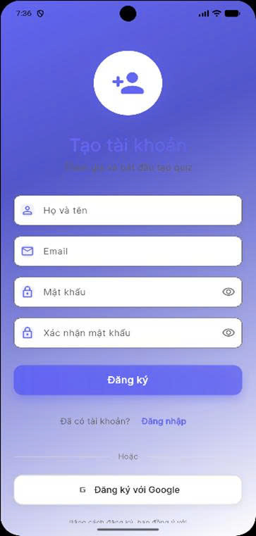
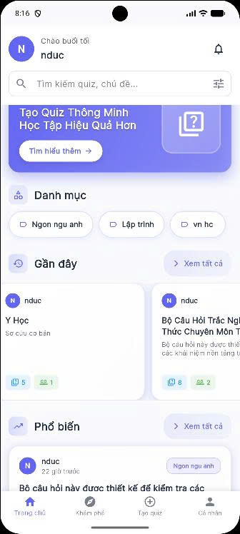
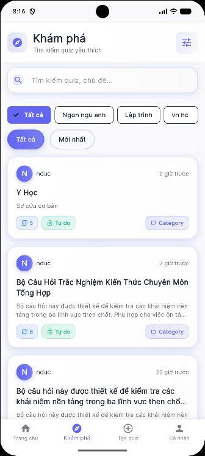
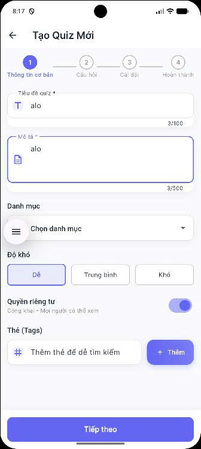
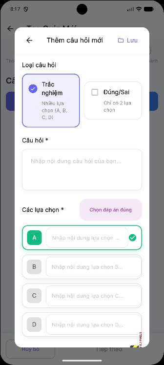
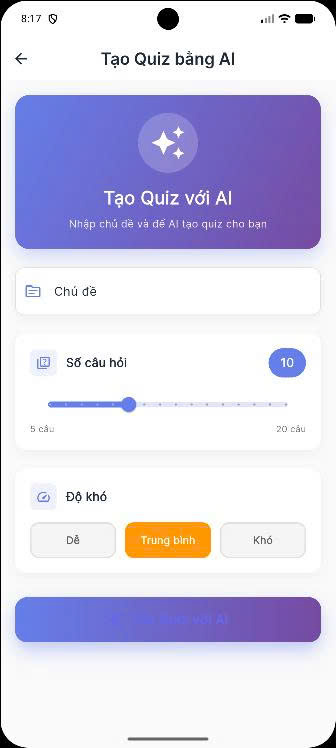
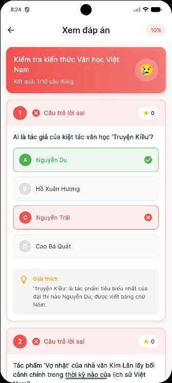
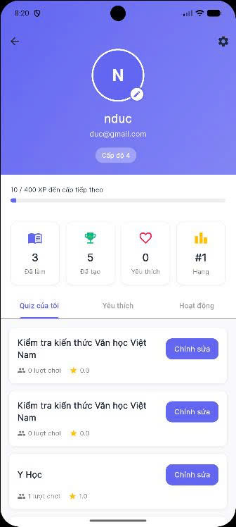
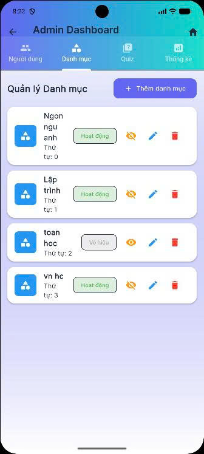
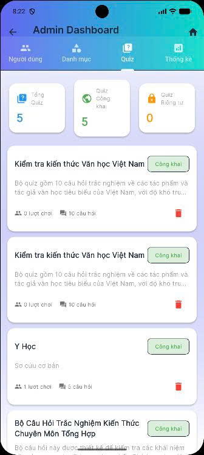

# 📱 QuizMaster - Ứng Dụng Tạo và Làm Quiz Thông Minh

Ứng dụng mobile Flutter cho phép tạo, chia sẻ và làm quiz với sự hỗ trợ của AI.


## ✨ Tính Năng

- 🔐 Đăng ký/Đăng nhập với Email & Password
- 🎯 Tạo quiz với form đa bước (Thông tin → Câu hỏi → Cài đặt → Hoàn thành)
- 🤖 Tạo quiz tự động bằng AI (Google Gemini)
- 📱 Làm quiz với timer và xem kết quả chi tiết
- 🏠 Trang chủ và khám phá quiz
- 👨‍💼 Admin Dashboard (quản lý users, quizzes, categories)
- 🌙 Dark Mode / Light Mode
- 🌍 Đa ngôn ngữ (Tiếng Việt / English)
- ⚙️ Cài đặt đầy đủ (profile, theme, language, security)

## 🚀 Cài Đặt và Chạy

### Yêu Cầu
- Flutter SDK 3.24+
- Firebase project đã được tạo
- Google Gemini API key (cho tính năng AI)

### Bước 1: Clone Repository
```bash
git clone <repository-url>
cd doanlaptrinh
```

### Bước 2: Cài Đặt Dependencies
```bash
flutter pub get
```

### Bước 3: Code Generation
```bash
flutter pub run build_runner build --delete-conflicting-outputs
```

### Bước 4: Cấu Hình Firebase

1. Tải file `google-services.json` từ Firebase Console
2. Đặt vào `android/app/google-services.json`
3. Thêm SHA-1/SHA-256 fingerprints trong Firebase Console
4. Bật Email/Password authentication trong Firebase Console

### Bước 5: Cấu Hình Gemini API

Thêm API key vào file `lib/features/ai/data/datasources/gemini_api_datasource.dart`:
```dart
static const String _apiKey = 'YOUR_GEMINI_API_KEY';
```

### Bước 6: Chạy Ứng Dụng
```bash
flutter run
```

## 📸 Hình Ảnh Ứng Dụng


### Trang Welcome

*Màn hình chào mừng với animation và gradient*

### Trang Đăng Nhập

*Form đăng nhập với thiết kế hiện đại*

### Trang Đăng Ký

*Form đăng ký với validation*

### Trang Chủ

*Trang chủ với quiz gần đây, danh mục và tính năng nổi bật*

### Trang Khám Phá

*Tìm kiếm và lọc quiz với bộ lọc nâng cao*

### Tạo Quiz - Bước 1: Thông Tin Cơ Bản

*Form nhập thông tin cơ bản của quiz*

### Tạo Quiz - Bước 2: Câu Hỏi

*Thêm câu hỏi với giao diện hiện đại*

### Form Thêm Câu Hỏi

*Dialog thêm câu hỏi với các tùy chọn*

### Tạo Quiz - Bước 3: Cài Đặt

*Cấu hình cài đặt quiz (công khai, xem lại đáp án, v.v.)*

### Tạo Quiz Bằng AI

*Tạo quiz tự động bằng AI với tùy chỉnh*

### Làm Quiz

*Giao diện làm quiz với timer*

### Kết Quả Quiz

*Xem kết quả với emoji động và màu sắc*

### Xem Lại Đáp Án

*Chi tiết từng câu hỏi và đáp án*

### Trang Profile

*Hồ sơ người dùng với thống kê*

### Trang Cài Đặt

*Cài đặt với dark mode và ngôn ngữ*

### Admin Dashboard

*Dashboard quản lý với các tab*

### Quản Lý Quiz

*Quản lý tất cả quiz trong hệ thống*


## 📝 Lưu Ý

- Tài khoản admin mặc định: `ad@gmail.com` / `12345vh`
- Đảm bảo đã cấu hình Firebase và Gemini API trước khi chạy
- File `google-services.json` phải được thêm vào `android/app/`

## 📄 License

Dự án học tập - Đồ án Lập Trình Mobile

---

**Phiên bản**: 1.0.0  
**Cập nhật**: Tháng 1, 2025
